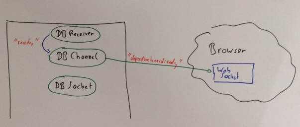

# DB Railway Departure Info

Current build status: [](https://travis-ci.org/koenighotze/db-schedule)


Test project for using OTP, Phoenix, Ecto to build a service for fetching departure board data.

The app is deployed to heroku and available here: https://protected-badlands-17194.herokuapp.com/


## Running the app Locally

### Prerequisites

* Postgres is running locally and matches the config in `dev.exs`.
* You own a key for the DB Rail Open Data API http://data.deutschebahn.com/dataset/api-fahrplan
* You own a Slack Command token https://api.slack.com/slash-commands

The app is started using a command like
```
SLACK_TOKEN=slacktoken DB_API_KEY=apikey mix do clean, phoenix.server
```
Then, as always, open http://localhost:4000.

## Architecture and communication sketch

### Local execution and web interface





### Slack communication


## Heroku Notepad

Adding postgres and configure the pool size
```
heroku addons:create heroku-postgresql:hobby-dev
heroku config:set POOL_SIZE=18
```

Add Elixir and Phoenix buildpacks
```
heroku buildpacks:add "https://github.com/HashNuke/heroku-buildpack-elixir.git"
heroku buildpacks:add https://github.com/gjaldon/heroku-buildpack-phoenix-static.git
```

Setting important Env variables
```
heroku config:set DB_API_KEY="xxx"
heroku config:set SECRET_KEY_BASE="xxx"
heroku config:set SLACK_TOKEN="xxx"
```

Fetching logs
```
heroku logs -t
```

Running mix commands
```
heroku run "POOL_SIZE=2 mix deps.get"
heroku run "POOL_SIZE=2 mix ecto.migrate"
```

## Todos

* Unit Tests
* Login
* WebSocket security
